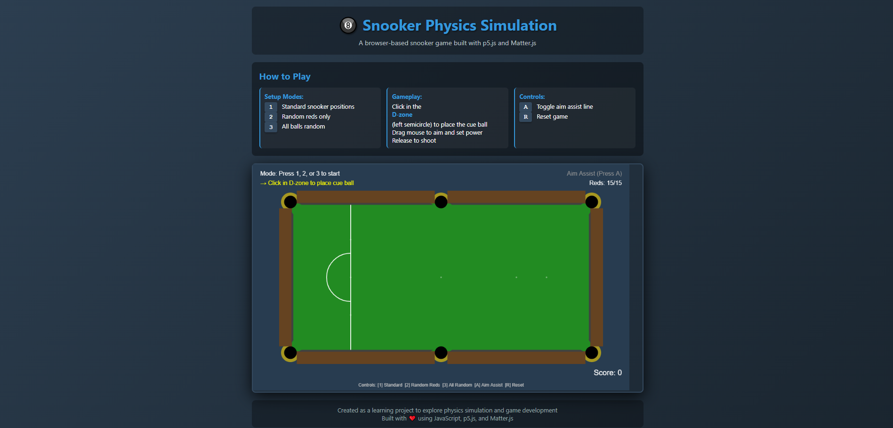

# 🎱 Snooker Physics Simulation

A browser-based snooker game built during my second year of Computer Science studies to learn about physics simulation, collision detection, and game development principles.



## 🎮 [Play the Live Demo](https://hamzabadat.github.io/Snooker-Game/)

## 📖 About This Project

This project was created as a learning exercise to understand:
- **Physics engine integration** (Matter.js)
- **Collision detection systems** and event handling
- **Game state management** and logic flow
- **Modular code architecture** for maintainability
- **Canvas rendering** with p5.js

### What I Learned

- How to integrate and configure a 2D physics engine
- Implementing proper collision detection and response
- Managing game state across multiple modules
- Creating realistic ball physics (friction, restitution, velocity)
- Separating concerns (rendering, physics, input handling, game logic)
- Using constants to make code maintainable and scalable

## ✨ Features

- **Realistic Physics**: Ball movement, collisions, and cushion bounces using Matter.js physics engine
- **Multiple Setup Modes**: 
  - Standard snooker starting positions
  - Random red ball placement
  - Fully random ball placement
- **Snooker Rules Implementation**:
  - D-zone cue ball placement
  - Colored ball re-spotting after potting
  - Foul detection (consecutive colored balls)
- **Visual Feedback**:
  - Power indicator for shots
  - Collision detection messages
  - Aim assist line (toggle-able)
  - 3D ball rendering with shadows and highlights

## 🎯 How to Play

1. **Setup**: Press `1`, `2`, or `3` to place balls in different configurations
2. **Place Cue Ball**: Click inside the D-zone (left semicircle) to place the white ball
3. **Aim**: Move your mouse to aim the cue stick
4. **Shoot**: Drag farther from the cue ball for more power, release to shoot
5. **Aim Assist**: Press `A` to toggle the aim assist line

### Controls

| Key | Action |
|-----|--------|
| `1` | Place balls in standard snooker positions |
| `2` | Random red balls, standard colored positions |
| `3` | All balls in random positions |
| `A` | Toggle aim assist line |
| `R` | Reset the game |
| Mouse | Aim and shoot (drag to set power) |

## 🛠️ Technical Details

### Technologies Used

- **JavaScript (ES6)**: Core game logic
- **p5.js**: Canvas rendering and drawing
- **Matter.js**: 2D physics engine for realistic ball movement

### Code Structure

The project uses a modular architecture with clear separation of concerns:

```
snooker-game/
├── index.html          # Main HTML file with game container
├── constants.js        # All game constants and configuration
├── variables.js        # Global variables and state
├── setup.js           # p5.js setup and main game loop
├── table.js           # Table rendering and cushion creation
├── balls.js           # Ball creation, placement, and rendering
├── cue.js             # Cue stick mechanics and drawing
├── physics.js         # Collision detection and re-spotting
├── input.js           # Keyboard and mouse input handling
└── game.js            # Game logic, scoring, and UI
```
## 🚀 Running Locally

1. Clone this repository
```bash
git clone https://github.com/yourusername/snooker-game.git
cd snooker-game
```

2. Open `index.html` in a web browser
   - No build process required!
   - No server needed!
   - Just open the file and play

## 📚 Known Limitations

This is a learning project with some intentional simplifications:

- **Rules**: Not all professional snooker rules are enforced
- **Turns**: No turn-based system (continuous play)
- **Score Tracking**: Basic scoring without full game state
- **Ball Reset**: Colored balls always respot to original positions (simplified snooker rules)
- **UI**: Basic interface focused on functionality over aesthetics

These limitations were conscious choices to focus on core physics simulation and code architecture rather than building a complete snooker game.


## 🤝 Acknowledgments

- Physics engine: [Matter.js](https://brm.io/matter-js/)
- Rendering library: [p5.js](https://p5js.org/)
- Learning resources: The Coding Train tutorials

## 📝 License

MIT License - feel free to use this code for learning purposes!

---

**Note**: This project was created as a learning exercise in physics simulation and game development. It demonstrates understanding of physics engines, collision detection, and modular code architecture, but was intentionally kept simple to focus on core concepts rather than building a production-ready game.
